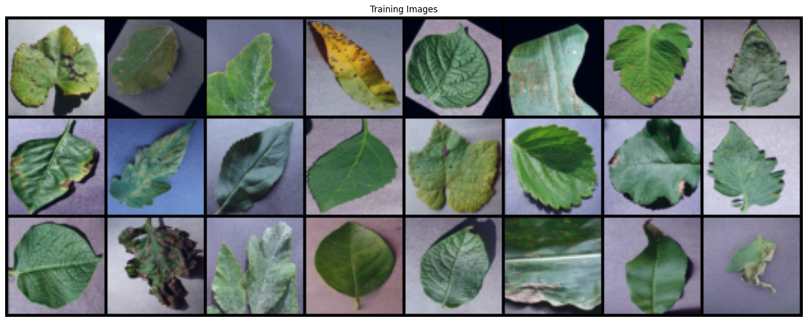

# GAN Augmentation: use generative models for data augmentation.
The aim of this project is to show how the use of generative models, such as Generative Adversarial Networks (GANs) and Diffusion Models, in the Data Augmentation phase can lead to an effective improvement in the performance of a classification model. In carrying out this work, we used the ’New Plant Diseases Dataset’ available on the kaggle platform. The dataset contains 25.800 images of plants divided into 38 classes, which represent diseases of particular types of plants. Below are some examples of images used in the construction of the model.

Initially, an _resnet18_ network was trained, using the _fine-tuning_ technique, in classifying different diseases using the image dataset described above. Subsequently, using the same set of images, a Deep Convolutional Generative Adversarial Network (Conditional DCGAN) was trained to reproduce the same images. The latter were subsequently added to the former by expanding the image dataset. At this point, the classifier was again trained using this new set of images. Finally, both the images and the results obtained from the classifications of the two models were compared in order to assess whether enlarging the image dataset by using the generative models led to improvements.

For further details on image analysis and model construction, see the following [pdf](KD_homework2.pdf)
