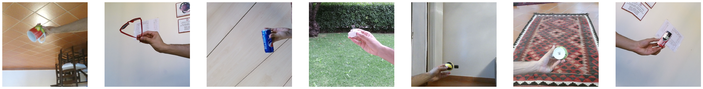
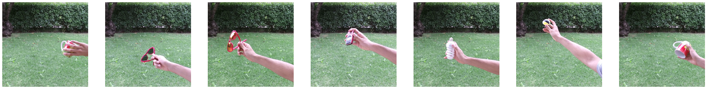

# Stay Focused: Our solution to AI@UNICT 2023 - Image classification with distribution shift

The aim of the challenge was to build a model capable of classifying eight types/classes of objects in different images. These classes were as follows: ’plug’, ’mobile phone’, ’scissor ’, ’lamp’, ’pepsi ’, ’sunglasses’, ’ball ’ and ’cup’.

The dataset containing the images is available at the following [link](https://www.kaggle.com/competitions/aiunict-2023/data).

The images are already divided into train and test images and, in addition, for each one we find a file in .csv format containing for each image the coordinates of the buonded box enclosing the object, which will be useful for focusing the network only in the region of the pixels that draw the object.

Let us focus our attention on the train dataset. As already mentioned, the images differ in eight object classes. For seven of them, in particular for all classes except the class ’plug’, the objects occur in different backgrounds. For images with class plug, all images have the same background, which is not shared with any other class.

This leads to each classifier network having a strong bias against this class. Moreover, in the images of the test dataset, all objects have the same background, the same as the plug class. The real challenge therefore lies in eliminating this bias in the decision-making process of the model.

For further details on the analysis and pre-processing of the images and the construction of the model, see the following [pdf](KD_homework1.pdf).
